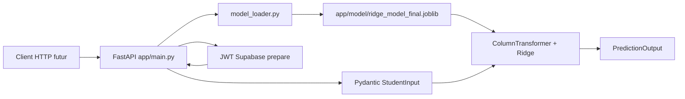
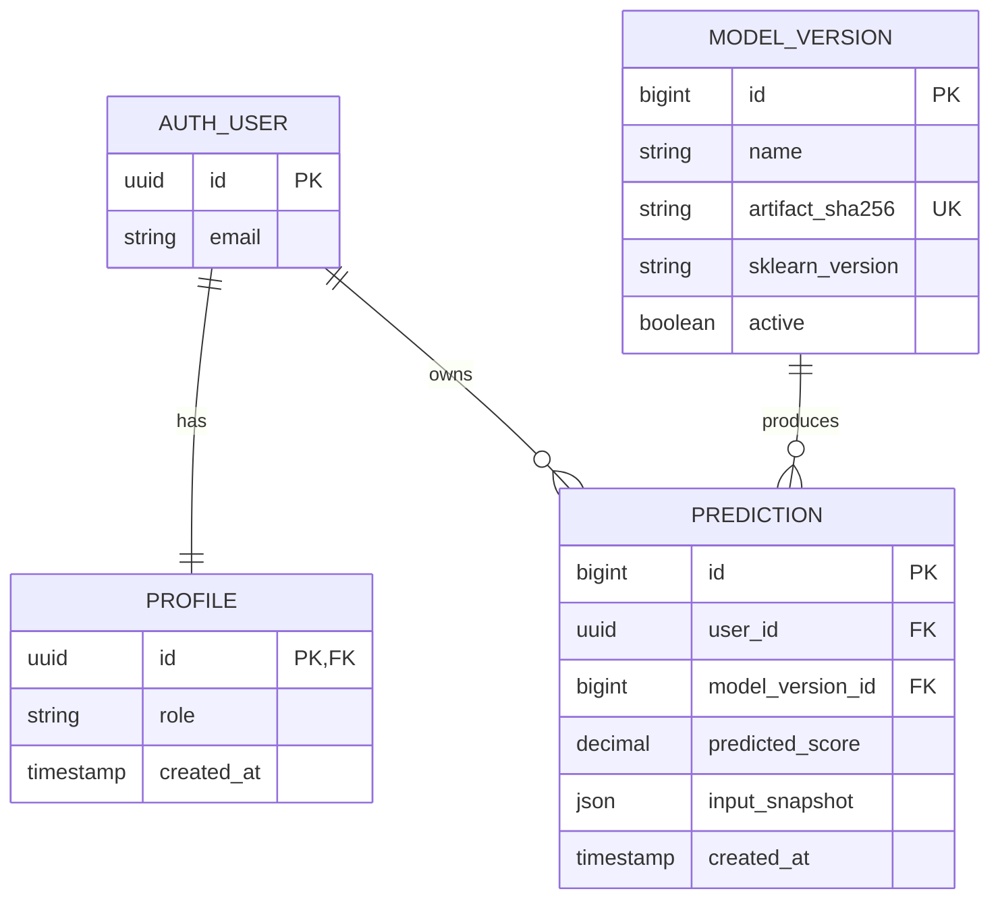

# Student Performance Predictor
## Project Handoff & Learning Guide

> Document produit a partir de l'etat observe du depot `/home/nick/Bureau/app` le 2026-09-18.
> Les faits viennent des fichiers presents, du notebook, des artefacts charges et de l'historique Git. Les propositions de conception sont marquees comme telles.

## 1. Executive Summary

Student Performance Predictor est un projet de regression supervisée qui estime `Exam_Score` a partir de donnees relatives a un etudiant. Le depot contient aujourd'hui :

- un dataset CSV de 6 607 lignes et 21 colonnes ;
- un notebook d'exploration, de selection de variables, d'entrainement et d'evaluation ;
- un pipeline scikit-learn Ridge serialize avec joblib ;
- une API FastAPI exposant une prediction ;
- des schemas Pydantic et onze tests d'API ;
- aucune base de donnees, aucun frontend versionne, aucune migration et aucun deploiement.

La decision fonctionnelle est maintenant actee : le MVP comportera une authentification reelle, un historique personnel et deux roles, `student` et `admin`. La persistance cible est Supabase/PostgreSQL avec Supabase Auth et RLS. La verification JWT et les gardes de role sont preparees cote backend, mais Supabase et l'historique ne sont pas encore connectes.

## 2. Business Problem

### 2.1 Objectif metier

Le systeme cherche a fournir une estimation numerique du score d'examen d'un etudiant afin d'aider a reperer des facteurs associes a sa performance et a afficher quelques signaux d'accompagnement. La valeur actuelle est une prediction rapide et une validation d'entree stricte ; elle ne constitue pas encore un dossier scolaire ni une decision pedagogique automatisee.

Le public cible n'est pas explicitement documente. Les utilisateurs plausibles sont un etudiant, un enseignant ou un conseiller, mais cela doit etre valide avant de concevoir les comptes et les droits d'acces.

### 2.2 Perimetre actuel

Inclus : prediction de `Exam_Score` a partir de six variables, validation Pydantic, chargement d'un pipeline local, retour du modele, de cinq coefficients et de seuils d'alerte simples. Les contrats prepares `/predictions`, `/predictions/me` et `/admin/predictions` exigent deja un JWT verifie, mais retournent 501 sans Supabase.

Non encore implemente : connexion reelle a Supabase Auth, gestion persistante des comptes et profils, stockage d'une prediction, suivi longitudinal, frontend versionne, entrainement en production, monitoring, deploiement et gestion de consentement. La verification JWT et la distinction `student/admin` sont preparees dans l'API, sans persistance reelle.

## 3. Current Project Status

| Fonctionnalite | Fichiers | Etat | Fonctionnement et limites |
|---|---|---|---|
| Analyse exploratoire et preparation | `notebooks/data_science.ipynb`, `data/SPP.csv` | ✅ Termine pour le notebook | Analyse du dataset, split, selection de variables, entrainement et evaluation. Le notebook reste la source de procedure, pas un script reproductible de production. |
| Selection des features finales | `notebooks/final_features_list.csv`, notebook | ✅ Termine | Six variables sont retenues : `Attendance`, `Hours_Studied`, `Previous_Scores`, `Tutoring_Sessions`, `Access_to_Resources`, `Parental_Involvement`. La justification repose sur permutation importance CV et comparaison de modeles. |
| Pipeline ML serialize | `app/model/ridge_model_final.joblib`, `notebooks/ridge_model_final.joblib` | ✅ Termine, a controler | Pipeline `ColumnTransformer` + `Ridge(alpha=10.0)`. Deux copies existent. La version scikit-learn et la parite notebook/API doivent rester controlees. |
| Chargement du modele | `app/model_loader.py` | ✅ Termine | Chargement joblib, verification de `predict` et de l'etape `model`, avertissement de version. La version attendue `1.9.1` est explicite et le chargement de fichier absent ou invalide produit une erreur claire. |
| Endpoint de sante | `app/main.py` route `GET /` | ✅ Termine | Retourne le nom du modele et l'ordre des features si le pipeline est charge. |
| Prediction | `app/main.py` route `POST /predict` | ✅ Termine | Construit une ligne pandas, appelle le pipeline, borne la sortie a `[0, 100]`, renvoie coefficients et seuils. Il n'y a pas de persistance. |
| Validation d'entree | `app/schemas.py` | ✅ Termine | Types, bornes, categories litterales et refus des champs supplementaires. Les bornes ne sont pas toutes exactement celles observees dans le dataset. |
| CORS | `app/main.py` | 🟡 Partiellement termine | Origines localhost:8501 et localhost:3000 autorisees. Aucun frontend correspondant n'est present dans le depot. |
| Tests API | `app/test_main.py` | ✅ Suite executee | Onze tests couvrent lifespan, prediction valide, validation, erreur interne, artefact absent, JWT, isolation student et garde admin. Resultat verifie : `11 passed, 2 warnings`. |
| Base de donnees | `docs/ADR-001-supabase-auth-and-roles.md` | 🟡 Preparation terminee | Supabase/PostgreSQL, Auth, profils, model versions, predictions et RLS sont decides ; aucune migration ni connexion n'est encore implementee. |
| Frontend | Aucun fichier present | 🔴 Non termine | La cible est Next.js/BFF selon la roadmap, mais aucun fichier frontend n'est present. |
| Deploiement | Aucun Docker/CI/config de deploiement | 🔴 Non termine | Aucune configuration de production verifiee. |

## 4. Architecture

### 4.1 Architecture observee

Le flux de donnees est actuellement en memoire et synchrone : le pipeline est charge au demarrage via le lifespan FastAPI, puis chaque requete fabrique un DataFrame d'une ligne. Aucun composant ne lit ou n'ecrit une base.

### 4.2 Inventaire des fichiers

| Chemin | Role |
|---|---|
| `README.md` | Installation, lancement Uvicorn, tests attendus et exemple de requete. |
| `requirements.txt` | Dependances FastAPI, Pydantic, scikit-learn, pandas, numpy, joblib et Uvicorn. |
| `app/main.py` | Application FastAPI, CORS, chargement au demarrage, routes et logique de prediction. |
| `app/model_loader.py` | Chargement et controles minimaux du pipeline joblib. |
| `app/schemas.py` | Schemas d'entree/sortie Pydantic. |
| `app/test_main.py` | Tests d'API avec `TestClient`. |
| `app/model/ridge_model_final.joblib` | Artefact consomme par l'API. |
| `data/SPP.csv` | Dataset source present localement. |
| `notebooks/data_science.ipynb` | Analyse, preprocessing, selection, entrainement et evaluation. |
| `notebooks/preprocessor.joblib` | Preprocesseur large sauvegarde separement ; il n'est pas charge par l'API actuelle. |
| `notebooks/final_features_list.csv` | Liste des six features finales. |
| `notebooks/top_15_features.csv` | Tableau d'importance de variables issu de l'analyse notebook. |
| `notebooks/figures/` | Figures EDA et analyse d'importance. |

Les recherches de depot n'ont pas trouve de `pyproject.toml`, `.env.example`, Dockerfile, compose file, configuration CI, `alembic.ini`, migration, module frontend ou module de base de donnees.

## 5. Dataset

### 5.1 Faits verifies

- Fichier : `data/SPP.csv`.
- Dimensions : 6 607 lignes, 21 colonnes.
- Cible : `Exam_Score`, entiere, minimum 55, maximum 101, moyenne environ 67,24.
- Doublons de lignes : 0 selon `pandas.DataFrame.duplicated()`.
- Valeurs manquantes : 90 pour `Parental_Education_Level`, 67 pour `Distance_from_Home`, 0 pour les autres colonnes.
- Source externe et licence : ⚠️ À vérifier. Le depot ne documente pas l'origine du CSV.
- Adaptation specifique au Cameroun : ⚠️ À vérifier. Des valeurs comme `Region`, `Language_Section`, `Electricity_Access` et `Transport_Mode` sont compatibles avec ce contexte, mais aucune decision d'adaptation n'est prouvee par le code.

### 5.2 Variables

| Variable | Type observe | Role / valeurs observees |
|---|---|---|
| `Hours_Studied` | numerique entiere | Heures etudiees, 1-44. |
| `Attendance` | numerique entiere | Assiduite, 60-100. |
| `Parental_Involvement` | categorielle | `Low`, `Medium`, `High`. Feature finale. |
| `Access_to_Resources` | categorielle | `Low`, `Medium`, `High`. Feature finale. |
| `Extracurricular_Activities` | categorielle | `No`, `Yes`. |
| `Sleep_Hours` | numerique entiere | 4-10. |
| `Previous_Scores` | numerique entiere | 50-100. Feature finale. |
| `Internet_Access` | categorielle | `Yes`, `No`. |
| `Tutoring_Sessions` | numerique entiere | 0-8. Feature finale. |
| `Family_Income` | categorielle | `Low`, `Medium`, `High`. |
| `School_Type` | categorielle | `Public`, `Private`. |
| `Physical_Activity` | numerique entiere | 0-6. |
| `Parental_Education_Level` | categorielle avec manquants | `High School`, `College`, `Postgraduate`, plus manquants. |
| `Distance_from_Home` | categorielle avec manquants | `Near`, `Moderate`, `Far`, plus manquants. |
| `Gender` | categorielle | `Male`, `Female`. |
| `Exam_Score` | numerique entiere | Target, 55-101 dans le fichier. |
| `Electricity_Access` | categorielle | `yes`, `no`, `sometimes`. |
| `Region` | categorielle | 10 regions dont `Adamawa`, `Centre`, `East`, `Far North`, `Littoral`, `North`, `North West`, `South`, `South West`, `West`. |
| `Transport_Mode` | categorielle | `Bike`, `Bus`, `Private car`, `Taxi`, `Walk`. |
| `Class_Size` | numerique entiere | 20-199. |
| `Language_Section` | categorielle | `Anglophone`, `Bilingual`, `Francophone`. |

Le score maximal 101 et les bornes API `[0, 100]` ne sont pas parfaitement alignés. La route borne la prediction a 100, mais la donnee cible n'est pas nettoyee par le code actuel. Ce point doit etre valide avant toute interpretation metier.

## 6. Data Cleaning & Preprocessing

### 6.1 Pipeline large du notebook

L'artefact `notebooks/preprocessor.joblib` contient un `ColumnTransformer` avec :

- variables numeriques : imputation par mediane puis `StandardScaler` pour `Hours_Studied`, `Attendance`, `Sleep_Hours`, `Previous_Scores`, `Tutoring_Sessions`, `Physical_Activity`, `Class_Size` ;
- variables categorielles : imputation constante par `Unknown` puis `OneHotEncoder(handle_unknown="ignore")` pour les 13 colonnes categorielles restantes.

L'imputation evite qu'une valeur manquante bloque l'entrainement ; la mediane est robuste aux valeurs extremes. `OneHotEncoder` transforme les categories en variables numeriques et `handle_unknown="ignore"` evite une erreur lorsqu'une categorie nouvelle arrive en prediction. Le scaling met les variables numeriques sur une echelle comparable, ce qui est important pour une regression regularisee.

### 6.2 Pipeline effectivement expose par l'API

Le pipeline charge depuis `app/model/ridge_model_final.joblib` est different :

- numeriques : `Attendance`, `Hours_Studied`, `Previous_Scores`, `Tutoring_Sessions` avec `StandardScaler` ;
- ordinales : `Access_to_Resources`, `Parental_Involvement` avec `OrdinalEncoder` et ordre explicite `Low < Medium < High` ;
- categories inconnues : encodees `-1` ;
- modele : `Ridge(alpha=10.0)`.

Ce pipeline ne contient donc ni imputation, ni `OneHotEncoder`, ni les 15 autres colonnes. C'est cohérent avec le schema API actuel, mais cette compatibilite n'est pas automatiquement garantie si le dataset ou le modele sont regenerees autrement.

### 6.3 Split et fuite de donnees

Le notebook utilise un train/test split de 80/20 : 5 285 observations d'entrainement et 1 322 de test. La validation croisee est faite sur le train uniquement, avec cinq folds `StratifiedKFold` construits a partir de cinq bins de `Exam_Score` via `pd.qcut`, afin de comparer les modeles sur les memes folds.

Les preprocessors sont places dans les pipelines soumis a la validation croisee, ce qui limite la fuite des statistiques de transformation entre folds. La justification exacte du split initial et la recherche d'un `random_state` dans toutes les cellules doivent etre relues avant de presenter cette reproductibilite comme garantie.

### 6.4 Outliers et transformations non verifiees

Le notebook contient des analyses graphiques de distributions et de residus. Aucun traitement general d'outliers, clipping des donnees d'entrainement, suppression de doublons ou transformation de la cible n'est documente comme applique. Le seul clipping verifie est celui de la prediction API vers `[0, 100]`. Ce clipping de sortie est une regle d'affichage/contrat, pas une correction du modele.

## 7. Machine Learning

### 7.1 Problematique

Il s'agit d'une regression supervisée : les features sont connues et la target numerique `Exam_Score` est fournie pendant l'entrainement. La regression est plus appropriee qu'une classification tant que l'objectif est un score continu ; une classification pourrait etre ajoutee plus tard pour des niveaux de risque, mais elle n'existe pas dans le code actuel.

### 7.2 Modeles compares

Le notebook compare les trois pipelines suivants sur les memes folds :

| Modele | Configuration observee | MAE moyen | RMSE moyen | R2 moyen |
|---|---|---:|---:|---:|
| Ridge | `alpha=1.0`, standardisation + encodage ordinal | 1.0390 | 2.3230 | 0.6486 |
| RandomForestRegressor | `n_estimators=200`, `max_depth=None`, `random_state=42` | 1.2979 | 2.5600 | 0.5732 |
| GradientBoostingRegressor | `n_estimators=200`, `learning_rate=0.1`, `random_state=42` | 1.1432 | 2.4151 | 0.6202 |

Ridge est une regression lineaire regularisee : elle ajoute une penalite L2 aux coefficients, ce qui aide a limiter les coefficients excessifs et le surapprentissage. Random Forest combine des arbres independants et Gradient Boosting ajoute des arbres successifs qui corrigent les erreurs. Les arbres n'ont pas besoin de scaling, d'ou le preprocessor distinct du notebook.

### 7.3 Tuning et selection

Le notebook utilise `GridSearchCV` sur `model__alpha` dans `[0.01, 0.1, 1.0, 10.0, 100.0]`, avec les memes folds et un scoring `R2`. Le meilleur alpha verifie est `10.0`, avec un meilleur R2 CV de `0.6486065167`. Le pipeline Ridge ajuste avec ce parametre est sauvegarde par joblib.

La decision est defendable parce que Ridge obtient le meilleur MAE, RMSE et R2 moyen parmi les trois candidats compares, puis `alpha=10` maximise le R2 dans la grille testee. Elle reste limitee aux modeles, features, folds et hyperparametres presents dans le notebook ; elle ne prouve pas une superiorite universelle.

## 8. Final Model

Le modele final consomme par l'API est un `sklearn.pipeline.Pipeline` avec deux etapes nommees `preprocessor` et `model`, la derniere etant `Ridge(alpha=10.0)`. L'artefact se trouve dans `app/model/ridge_model_final.joblib`; une copie identique en taille et representation est presente dans `notebooks/ridge_model_final.joblib`.

Evaluation test sauvegardee dans le notebook :

- MAE : `0.9533` ;
- MSE : `4.1513` ;
- RMSE mathematiquement coherent : `2.0375` ;
- R2 : `0.7063`.

Une cellule imprime `Test RMSE : 4.1513`, identique au MSE, puis la cellule suivante imprime `2.0375`. Le second resultat est coherent avec `sqrt(4.1513)` et doit etre retenu avec une mention de cette incoherence a corriger dans le notebook.

`model_loader.py` verifie que l'objet a `predict` et une etape `model`. Il compare la version scikit-learn attendue `1.9.1` et signale les erreurs de chargement. La compatibilite de version doit etre recontrolee si l'artefact est regenere ou deplace.

L'API extrait `model.coef_` et les associe directement aux six features. Cette interpretation est acceptable ici car le preprocessor final produit six colonnes dans le meme ordre ; elle deviendrait fausse avec un one-hot encoding ou un changement de pipeline. Les coefficients sont des effets du modele, pas une preuve de causalite.

## 9. Backend / API

### 9.1 Stack

Le backend utilise FastAPI, Pydantic v2, pandas, numpy, scikit-learn, joblib et Uvicorn. FastAPI fournit le routage et la documentation OpenAPI ; Pydantic valide et serialise les donnees ; joblib recharge l'artefact.

### 9.2 Endpoints

| Methode | Route | Entree | Sortie | Fonction |
|---|---|---|---|---|
| GET | `/` | Aucune | `model_name`, `features` | Verifie que le pipeline est charge et expose son nom ainsi que l'ordre des features. Retourne 503 si le pipeline n'est pas disponible. |
| POST | `/predict` | JSON conforme a `StudentInput` | `PredictionOutput` | Execute une prediction et renvoie score, coefficients des cinq variables les plus influentes et variables sous seuil. |
| POST | `/predictions` | JWT + `StudentInput` | `501` actuellement | Contrat reserve a l'enregistrement d'une prediction liee a l'utilisateur connecte ; Supabase n'est pas encore branche. |
| GET | `/predictions/me` | JWT | `501` actuellement | Contrat reserve a l'historique isole de l'etudiant connecte. |
| GET | `/admin/predictions` | JWT admin | `501` actuellement | Verifie le role `admin` cote backend ; refuse `student` en `403` avant la future lecture globale. |

`StudentInput` exige six champs, interdit les champs supplementaires et applique : `Attendance` et `Previous_Scores` entre 0 et 100, `Hours_Studied` entre 0 et 45, `Tutoring_Sessions` entre 0 et 8, plus les trois categories `Low/Medium/High` pour les deux variables ordinales.

`PredictionOutput` borne `predicted_score` entre 0 et 100. Les seuils metier codes en dur sont 70 pour `Attendance`, 10 pour `Hours_Studied`, 60 pour `Previous_Scores` et 2 pour `Tutoring_Sessions`. Leur origine pedagogique n'est pas documentee : ⚠️ À vérifier.

### 9.3 Gestion des erreurs et risques

Le demarrage leve une erreur runtime si le fichier du modele est absent. La construction du DataFrame et la prediction convertissent les exceptions en HTTP 500. Les erreurs de validation Pydantic deviennent normalement HTTP 422.

Problemes connus : pas de timeout ni de journalisation structuree, pas de version d'API, pas de stockage des requetes, CORS configure pour des origines de developpement seulement, et verification JWT actuellement preparee pour HS256. Les logs incluent les donnees de requete ; cela devra etre reconsidere si des donnees personnelles sont introduites.

## 10. Database Preparation

La base doit repondre a un besoin applicatif confirme, pas simplement stocker une copie du CSV. Le besoin minimal deduit de l'API est de conserver, si l'on veut un historique, les donnees d'entree, la prediction produite, le modele utilise et le moment de la prediction.

### 10.1 Donnees persistantes versus temporaires

Persistantes potentielles :

- profil ou identifiant d'un etudiant, si l'application gere des personnes identifiables ;
- snapshot des six features envoyees a chaque prediction ;
- score predit, nom/version du modele, date, statut et eventuel message d'erreur ;
- metadonnees d'un modele deploye ;
- utilisateur proprietaire et audit, seulement si authentification est ajoutee.

Temporaires : DataFrame pandas construit pour une requete, pipeline charge en memoire, coefficients calcules pour la reponse et liste de seuils tant qu'elle n'est pas geree comme une configuration metier.

### 10.2 Entites decidees

Le modele conceptuel MVP est compose de `auth.users` geree par Supabase, `profiles` pour le role applicatif, `predictions` pour l'historique et `model_versions` pour la traçabilite du modele. Il n'y aura pas de table applicative `users` parallele ni de table `students` dans le perimetre actuel. Les features de prediction seront conservees comme snapshot, car elles representent l'etat au moment du calcul.

Ce diagramme est aligne avec la decision MVP authentifiee. `auth.users` est geree par Supabase ; `profiles` porte le role applicatif ; aucune table `users` ou `students` parallele ne doit etre recreee.

## 11. Proposed Database Schema

### Option recommandee actee : MVP authentifie student/admin

| Table | Colonne | Type indicatif | Contraintes | Description |
|---|---|---|---|---|
| `model_versions` | `id` | BIGINT | PK | Identifiant interne. |
| `model_versions` | `name` | VARCHAR(100) | NOT NULL | Exemple `Ridge`. |
| `model_versions` | `artifact_sha256` | CHAR(64) | NOT NULL, UNIQUE | Identite immuable de l'artefact. |
| `model_versions` | `sklearn_version` | VARCHAR(30) | NOT NULL | Version ayant produit/charge l'artefact. |
| `model_versions` | `feature_order` | JSON | NOT NULL | Contrat d'ordre des six features. |
| `model_versions` | `is_active` | BOOLEAN | NOT NULL DEFAULT false | Modele utilisable par l'API. Unicite active a traiter. |
| `model_versions` | `created_at` | TIMESTAMP | NOT NULL | Date d'enregistrement. |
| `predictions` | `id` | BIGINT | PK | Identifiant prediction. |
| `predictions` | `user_id` | UUID | NOT NULL, FK vers `auth.users.id` | Proprietaire de la prediction. |
| `predictions` | `model_version_id` | BIGINT | NOT NULL, FK | Modele ayant produit le resultat. |
| `predictions` | `attendance` | DECIMAL(5,2) | NOT NULL, CHECK 0..100 | Snapshot de l'entree. |
| `predictions` | `hours_studied` | DECIMAL(6,2) | NOT NULL, CHECK >= 0 | Snapshot de l'entree. |
| `predictions` | `previous_scores` | DECIMAL(5,2) | NOT NULL, CHECK 0..100 | Snapshot de l'entree. |
| `predictions` | `tutoring_sessions` | INTEGER | NOT NULL, CHECK 0..8 | Snapshot de l'entree. |
| `predictions` | `access_to_resources` | VARCHAR(20) | NOT NULL, CHECK enum | Snapshot categoriel. |
| `predictions` | `parental_involvement` | VARCHAR(20) | NOT NULL, CHECK enum | Snapshot categoriel. |
| `predictions` | `predicted_score` | DECIMAL(5,2) | NOT NULL, CHECK 0..100 | Resultat expose par l'API. |
| `predictions` | `below_threshold` | JSON | NOT NULL | Explication generee au moment du calcul. |
| `predictions` | `created_at` | TIMESTAMP | NOT NULL | Date de la prediction. |

Relations : un utilisateur peut avoir plusieurs predictions et un modele peut produire plusieurs predictions ; chaque prediction reference exactement un utilisateur et un modele (`N:1` dans les deux cas). Les policies RLS isolent les lignes student et donnent a admin une lecture globale.

### Contraintes a discuter

- Les CHECK SQL renforcent la validation API mais ne remplacent pas Pydantic.
- Une prediction doit garder le modele exact et les inputs exacts pour etre explicable et reproductible.
- Les donnees personnelles ne doivent pas etre ajoutees sans besoin, consentement et politique de retention.
- Un index sur `predictions.created_at` et `model_version_id` est utile pour l'historique et l'audit.
- Le choix JSON versus colonnes normalisees pour `input_snapshot` est une decision de schema : les colonnes sont meilleures pour filtrer et contraindre ; JSON est pratique pour conserver un contrat evolutif.

## 12. Technical Decisions

### Decisions observees

- FastAPI est le framework backend present.
- Pydantic valide les contrats d'entree/sortie.
- Le modele final est Ridge regularise et serialize avec joblib.
- Six features et leur ordre sont un contrat implicite entre modele, schema et API.
- Le pipeline complet est charge au demarrage et reutilise en memoire.
- La prediction est bornee a `[0, 100]` dans la reponse.

### Choix database

Supabase/PostgreSQL est le choix acté pour le MVP, car il fournit PostgreSQL, Supabase Auth et RLS dans le même service. **Decision pending** : choisir le client `supabase-py` ou SQLAlchemy + driver PostgreSQL pour l'implementation. Les dependances de connexion DB et les migrations SQL restent a ajouter. SQLite et MySQL ne sont pas des options du MVP actuel.

## 13. Theoretical Knowledge Map

### Niveau 1 - Python et ingenierie

Modules/imports, fonctions, annotations de type, exceptions, context managers, dictionnaires/listes, logging, chemins `pathlib`, environnements virtuels, packages et tests.

### Niveau 2 - Data

DataFrame pandas, types numeriques/categoriques, valeurs manquantes, mediane, doublons, distribution, correlation, encodage, representation tabulaire, train/test split et reproductibilite par seed.

### Niveau 3 - Machine Learning

Apprentissage supervise, regression, feature/target, baseline, regularisation L2, Ridge, arbres, scaling, encodage ordinal et one-hot, pipeline, `ColumnTransformer`, imputation, cross-validation, stratification par bins, GridSearchCV, hyperparametres, overfitting, biais/variance, fuite de donnees, residus, MAE, MSE, RMSE, R2, importance par permutation et limites de l'interpretation des coefficients.

### Niveau 4 - Backend

HTTP, REST, route, methode, statut 200/422/500/503, JSON, schema, validation, serialization, lifespan, middleware, CORS, OpenAPI, client de test, logging et gestion des erreurs.

### Niveau 5 - Database a apprendre avant implementation

SQL, table, colonne, relation, primary key, foreign key, cardinalite, contraintes, NULL, UNIQUE, CHECK, normalisation, CRUD, index, transaction, isolation, ORM, SQLAlchemy, session, migrations, Alembic, retention, audit et protection des donnees.

## 14. Knowledge Gaps

| Notion | Indice dans le projet | Ce qu'il faut savoir expliquer | Priorite |
|---|---|---|---|
| Choix regression vs classification | `Exam_Score` est traite comme cible continue | Pourquoi une note continue, et quand creer des classes | 🟠 Important - À vérifier avec le mentor |
| Pipeline et fuite de donnees | `Pipeline` + `ColumnTransformer` dans le notebook | Pourquoi ajuster le preprocessing dans chaque fold | 🔴 Critique - À vérifier avec le mentor |
| Encodage ordinal | Ordre explicite `Low/Medium/High` | Quand l'ordre est legitime et pourquoi one-hot serait different | 🔴 Critique - À vérifier avec le mentor |
| Regularisation Ridge | `Ridge(alpha=10)` | Effet de alpha, biais/variance et coefficients | 🔴 Critique - À vérifier avec le mentor |
| Validation croisee stratifiee | cinq folds sur bins de target | Pourquoi stratifier en regression et quelles limites cela a | 🟠 Important - À vérifier avec le mentor |
| MAE, MSE, RMSE, R2 | scoring CV et test | Interpretration metier et sensibilite aux grosses erreurs | 🔴 Critique - À vérifier avec le mentor |
| Interpretation des coefficients | `top_features` de l'API | Effet du scaling, signe, ordre et absence de causalite | 🔴 Critique - À vérifier avec le mentor |
| Version d'artefact | joblib et avertissement sklearn | Compatibilite de serialization et reproductibilite | 🟠 Important - À vérifier avec le mentor |
| Contrat API | Pydantic et HTTP 422 | Validation, schema, erreurs et statuts HTTP | 🟠 Important - À vérifier avec le mentor |
| Modelisation relationnelle | base absente | Choisir ce qui doit etre persiste et eviter les donnees personnelles inutiles | 🔴 Critique - À vérifier avec le mentor |
| ORM et migrations | pas encore implementes | Difference SQL/ORM et pourquoi le schema doit etre versionne | 🔴 Critique - À vérifier avec le mentor |

Le code ne permet pas d'inferer le niveau reel de l'etudiant. Ces priorites sont des sujets de verification, pas un jugement de maitrise.

## 15. Mentor Questions

1. Pourquoi `Exam_Score` est-il une cible de regression ?
2. Que represente une feature et que represente la target dans ce projet ?
3. Pourquoi ne pas utiliser les 20 variables disponibles dans le modele final ?
4. Comment la permutation importance CV a-t-elle influence la selection des six variables ?
5. Quelle difference entre importance de permutation et coefficient Ridge ?
6. Pourquoi encoder `Low`, `Medium`, `High` ordinalement ?
7. Dans quel cas cet encodage serait-il trompeur ?
8. Pourquoi standardiser les variables avant Ridge ?
9. Pourquoi les pipelines d'arbres n'utilisent-ils pas le scaling ?
10. A quoi sert `ColumnTransformer` ?
11. Comment le pipeline limite-t-il le data leakage pendant la cross-validation ?
12. Pourquoi utiliser cinq folds et des bins de `Exam_Score` ?
13. Pourquoi un `DummyRegressor` aurait-il ete utile comme baseline, meme s'il n'est pas present ici ?
14. Que penalise `alpha` dans Ridge ?
15. Pourquoi `alpha=10` est-il retenu ?
16. Quelle difference entre MAE, MSE, RMSE et R2 ?
17. Pourquoi le RMSE ne peut-il pas etre egal au MSE sauf cas particulier ?
18. Comment expliquer MAE 0,9533 et R2 0,7063 a un utilisateur ?
19. Que signifie un residu positif dans le notebook ?
20. Le modele prouve-t-il qu'une feature cause la note ?
21. Pourquoi `Exam_Score` atteint-il 101 alors que l'API borne a 100 ?
22. Que se passe-t-il avec une categorie inconnue dans le pipeline actuel ?
23. Que se passe-t-il si l'ordre des colonnes change ?
24. Pourquoi sauvegarder le pipeline complet plutot que seulement Ridge ?
25. Pourquoi verifier la version de scikit-learn lors du chargement ?
26. Pourquoi charger le modele dans le lifespan FastAPI ?
27. Quelle difference entre une erreur 422, 500 et 503 ici ?
28. Pourquoi `extra="forbid"` est-il utile dans `StudentInput` ?
29. Que fait CORS et pourquoi les origines sont-elles explicites ?
30. Pourquoi les seuils `70`, `10`, `60`, `2` doivent-ils etre documentes ou configures ?
31. Quelles donnees de la prediction doivent etre conservees pour un audit ?
32. Pourquoi conserver la version exacte du modele avec chaque prediction ?
33. Pourquoi un snapshot des features est-il preferable a une simple reference vers un profil courant ?
34. Quand faut-il une table `Student` ? Quand faut-il une table `User` ?
35. Quelle est la cardinalite entre `ModelVersion` et `Prediction` ?
36. A quoi servent une primary key et une foreign key ?
37. Pourquoi une migration est-elle preferable a la creation manuelle de tables ?
38. Quelle difference entre SQLAlchemy et SQL ?
39. Pourquoi commencer par SQLite ou PostgreSQL, et quels sont les compromis ?
40. Quelles donnees ne faudrait-il pas stocker sans consentement ?
41. Comment tester qu'une prediction est bien rattachee au bon artefact ?
42. Comment tester une transaction qui echoue au milieu d'un enregistrement ?

## 16. Current Status Matrix

| Domaine | Etat | Derniere realisation | Prochaine etape |
|---|---|---|---|
| Problem Definition | ✅ | Objectif, public étudiant et rôles student/admin établis | Préciser les critères de succès du MVP |
| Data | ✅ | CSV inspecte, schema et qualite connus | Documenter source/licence et traiter le score 101 |
| Cleaning | 🟡 | Preprocessor notebook large et analyse des manquants | Formaliser un script reproductible |
| EDA | ✅ | Figures et analyses dans notebook | Conserver un resume lisible hors notebook |
| Feature Engineering | ✅ | Six features finales | Revalider selection apres correction des incoherences |
| ML | ✅ | Ridge, Random Forest, Gradient Boosting compares | Reproduire les metriques avec une procedure propre |
| Model Selection | ✅ | Ridge alpha 10 selectionne | Corriger la cellule RMSE et documenter la version |
| API | ✅ | `/` et `/predict` fonctionnels ; routes JWT préparées | Connecter Supabase et remplacer les `501` par la persistance réelle |
| Tests | ✅ | Onze tests executes | Ajouter ensuite tests d'integration Supabase, RLS et isolation |
| Database | 🟡 | ADR Supabase/Auth/RLS et routes 501 prepares | Creer tables, migrations et policies |
| Frontend | 🔴 | Aucun code present | Decider et implementer un client |
| Deployment | 🔴 | Aucun artefact | Ajouter configuration apres stabilisation |

## 17. Next Phase Roadmap - Database

| Etape | Objectif et fichiers | Prerequis / theorie | Livrable et critere de fin |
|---|---|---|---|
| 1. Requirements | Authentification et historique personnel actees ; documenter donnees et retention | Comprendre persistance, confidentialite et retention | Cas d'usage et roles valides |
| 2. Conceptual model | Utiliser `auth.users`, `profiles`, `predictions` et `model_versions` | Entites, relations, cardinalites | ERD relu et valide |
| 3. Relational model | Definir tables, contraintes, indexes | Normalisation, PK/FK, NULL, CHECK | Tables et contraintes justifiees |
| 4. Technology selection | Utiliser Supabase/PostgreSQL ; choisir client `supabase-py` ou SQLAlchemy | Transactions, ORM, migrations | Decision d'implementation ecrite |
| 5. Database setup | Ajouter config d'URL via variables d'environnement, sans secret versionne | Configuration et environnements | Connexion locale verifiee |
| 6. ORM setup | Creer package `app/db/`, engine, session et base declarative | Session SQLAlchemy et injection | Une session testable est disponible |
| 7. Models | Implementer `profiles`, `model_versions` et `predictions` ; ne pas recreer `auth.users` | Mapping ORM et contraintes | `create_all` n'est pas le mecanisme de migration final |
| 8. Migrations | Ajouter Alembic et premiere migration | Schema versionne | Migration up/down reproductible |
| 9. Repository/CRUD | Isoler les acces DB des routes | Transactions et repository pattern | Creation et lecture de prediction testees |
| 10. API integration | Enregistrer une prediction apres calcul, avec modele et snapshot | Atomicite et gestion d'erreur | `/predict` retourne le resultat meme si l'ecriture est controlee ; echec DB traite |
| 11. Tests | Ajouter tests unitaires, integration et contraintes | Fixtures, rollback, TestClient | Tests verts dans l'environnement documente |
| 12. Validation | Verifier historique, migrations, logs et donnees sensibles | Audit et retention | Vertical slice accepte avant frontend |

La premiere tache recommandee est de creer le projet Supabase puis les migrations `profiles`, `model_versions`, `predictions` et leurs policies RLS, en conservant les routes 501 jusqu'au premier test d'integration.

## 18. Instructions for the Next AI

Avant de modifier le code, lis d'abord ce document puis inspecte les fichiers concernes.

Le produit construit est un backend FastAPI de prediction de `Exam_Score` utilisant un pipeline Ridge serialise. L'etat actuel est pre-database : ne suppose pas qu'un frontend, un utilisateur ou une table existe parce qu'un commentaire CORS les mentionne. Preserve le contrat actuel des six features et l'ordre defini dans `app/main.py` tant qu'une regeneration du modele n'est pas decidee.

Fichiers prioritaires : `app/main.py`, `app/model_loader.py`, `app/schemas.py`, `app/test_main.py`, `app/model/ridge_model_final.joblib`, `notebooks/data_science.ipynb`, `requirements.txt` et `README.md`.

Contraintes : ne pas remplacer le pipeline final par le preprocessor large sans verifier la compatibilite ; ne pas presenter les tables proposees comme decisions ; ne pas introduire de donnees personnelles sans cas d'usage ; ne pas casser les routes existantes ; executer une verification ciblee apres chaque edit ; garder les artefacts et la version scikit-learn coherents.

Premiere action conseillee : creer le projet Supabase, puis ecrire les migrations SQL de `profiles`, `model_versions` et `predictions`, avec les policies RLS student/admin. Le choix `supabase-py` versus SQLAlchemy doit etre fait avant la connexion FastAPI.

## 19. Decisions / Assumptions / Known Issues

### Decisions confirmed

- Le projet est une regression de `Exam_Score`.
- Le pipeline API est Ridge avec `alpha=10.0`.
- Les six features finales et leur ordre sont ceux de `FEATURE_ORDER`.
- FastAPI/Pydantic/joblib/scikit-learn sont la stack actuelle.
- La reponse API borne le score a `[0, 100]`.

### Decisions pending

- Choix precis entre client `supabase-py` et SQLAlchemy + driver PostgreSQL.
- Retention, consentement et exposition de l'historique.
- Strategie finale de synchronisation de `profiles.role` avec le claim JWT.
- Source et licence du dataset.
- Traitement de la cible `Exam_Score=101`.

### Assumptions

- Le dataset est un jeu de travail local et non une base de production.
- Le MVP utilisera `auth.users` de Supabase et ne recreera pas une table `users`.
- Les roles applicatifs seront `student` et `admin`, sans droit d'ecriture admin sur les donnees d'un tiers.
- Les seuils codes dans l'API sont destines a fournir un signal pedagogique.
- Le client prevu pourrait utiliser une origine localhost:8501 ou localhost:3000, mais cela n'est pas confirme par un fichier frontend.
- Les coefficients peuvent etre associes directement aux six noms car l'artefact actuel produit six colonnes.

### Known issues

- Les tests ont ete executes apres installation de `requirements.txt` : `11 passed`, avec deux avertissements de deprecation Starlette/httpx.
- Le notebook contient une sortie RMSE incoherente dans une cellule ; la valeur coherente est 2.0375.
- La version `EXPECTED_SKLEARN_VERSION` est fixee a `1.9.1` ; elle devra etre mise a jour uniquement avec une regeneration et un test de compatibilite de l'artefact.
- La verification JWT locale utilise HS256 et devra etre adaptee si le projet Supabase utilise des cles asymetriques/JWKS.
- Le preprocessor large sauvegarde et le pipeline final API ne sont pas le meme artefact.
- Aucune base, migration, persistence, CI ou deployment n'est present.
- Les routes de persistence et de supervision sont preparees mais retournent volontairement HTTP 501.
- La cible contient la valeur 101 alors que le contrat API et le clipping utilisent 100.

### Technical debt

- Notebook non factorise en script d'entrainement reproductible.
- Artefacts dupliques entre `app/model` et `notebooks`.
- Contrat de modele non versionne par hash ou metadata applicative.
- Tests sans execution CI verifiee et couverture limitee des erreurs internes.
- Configuration et secrets non formalises.
- Seuils metier et chemins de modele codes en dur.
- Rotation/verification des secrets Supabase et tests RLS restent a implementer.

## 20. Technical Decision Records

## Decision: Use a complete serialized pipeline

### Context

Le modele a besoin de transformations differentes selon le type de feature, et l'API doit appliquer exactement les transformations d'entrainement.

### Decision

Sauvegarder et charger un pipeline scikit-learn complet, avec les etapes `preprocessor` et `model`.

### Reason

Cela evite de reimplementer le scaling et l'encodage dans l'API et reduit le risque de divergence entre entrainement et inference.

### Alternatives considered

Sauvegarder uniquement Ridge ou coder manuellement les transformations dans FastAPI.

### Consequences

L'artefact depend de versions compatibles de scikit-learn et doit etre versionne avec son ordre de features.

## Decision: Select six final features

### Context

Le dataset contient 20 variables candidates et l'analyse notebook mesure des importances par permutation avec validation croisee.

### Decision

Retenir `Attendance`, `Hours_Studied`, `Previous_Scores`, `Tutoring_Sessions`, `Access_to_Resources` et `Parental_Involvement`.

### Reason

Ces variables sont en tete de l'analyse et rendent le contrat API plus petit ; la comparaison CV sur ces six variables donne le meilleur resultat moyen a Ridge parmi les trois modeles compares.

### Alternatives considered

Utiliser toutes les variables, retenir les 16 variables positives de l'analyse intermediaire ou garder un modele large one-hot.

### Consequences

L'API est simple mais ignore de l'information potentiellement utile. Toute extension exige une regeneration coherente du pipeline et du schema.

## Decision: Use Ridge as current final model

### Context

Ridge, Random Forest et Gradient Boosting ont ete compares sur des folds identiques.

### Decision

Conserver Ridge et tuner `alpha` par `GridSearchCV`.

### Reason

Ridge obtient les meilleurs scores CV observes et `alpha=10` est le meilleur de la grille selon R2.

### Alternatives considered

Random Forest et Gradient Boosting, ainsi qu'un alpha different.

### Consequences

Le modele est compact et interpretable par coefficients, mais il suppose une relation largement lineaire et son interpretation depend du preprocessing.

## 21. Final Handoff Summary

Le socle ML et l'API de prediction existent. La prochaine fonctionnalite est l'implementation de la persistance Supabase pour un MVP authentifie. Le schema minimal est `profiles` + `model_versions` + `predictions`, avec snapshots d'entree, `user_id`, reference immuable au modele et policies RLS student/admin.

## Handoff Status

- **Etat global actuel :** 🟡 Prototype backend ML fonctionnel sur artefacts locaux, sans persistance.
- **Derniere etape terminee :** API FastAPI stabilisee, garde JWT student/admin preparee et tests executes.
- **Prochaine etape :** creer le projet Supabase puis implementer les migrations et policies RLS validees dans l'ADR.
- **Fichiers prioritaires :** `app/main.py`, `app/model_loader.py`, `app/schemas.py`, `app/test_main.py`, `requirements.txt`, `notebooks/data_science.ipynb`.
- **Points necessitant validation :** source/licence du dataset, cible 101, seuils pedagogiques, incoherence RMSE, support JWKS ou HS256 Supabase, choix `supabase-py`/SQLAlchemy et seed manuel du premier admin.
- **Premiere action recommandee pour la phase Database :** creer les migrations SQL `profiles`, `model_versions`, `predictions`, puis leurs policies RLS avant de connecter les routes FastAPI.